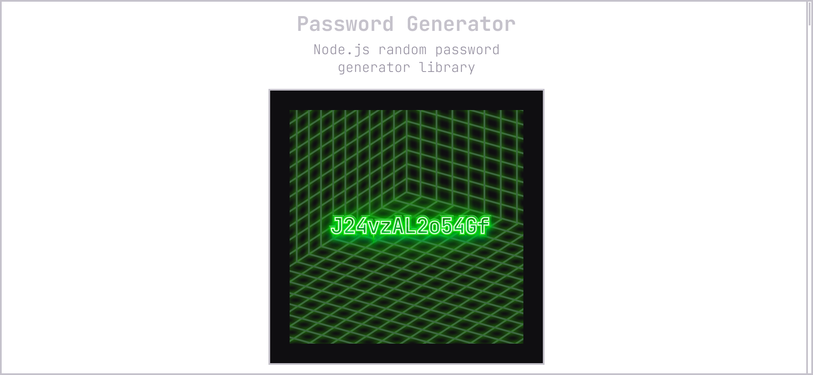

 

  

 

  <table>
    <tr>
      <td valign="top">
        <a style="color: #9691A1; text-decoration: underline; font-style: italic;" href="https://www.figma.com/file/pJyx0DbawEh9lk2nZKapXp/PasswordGenerator?node-id=0%3A1">
          Figma
        </a>
      </td>
      <td valign="top">
        <a style="color: #9691A1; text-decoration: underline; font-style: italic;" href="https://vitorgouveia.notion.site/Password-Generator-6cf9deb75c4142ecbd703698e29fd06d">
          Notion
        </a>
      </td>
    </tr>
  </table>

---
 

<h2 style="color: #C5C2CB;">Table of Contents</h2>

<ul style="list-style: none;">
  <li>
    <a
      style="border-left: 2px solid #896AC8; padding-left: 1rem; color: #896AC8;"
      href="#introduction"
    >
      Introduction
    </a>
  </li>
  <li>
    <a
      style="border-left: 2px solid transparent; padding-left: 1rem; color: #AEAAB6;"
      href="#structure"
    >
      Structure
    </a>
    <ul style="list-style: none;">
      <li>
        <a
          style="border-left: 2px solid transparent; color: #AEAAB6;"
          href="#structure-web"
        >
          Web
        </a>
      </li>
    </ul>
  </li>
  <li>
    <a
      style="border-left: 2px solid transparent; padding-left: 1rem; color: #AEAAB6;"
      href="#my-experience"
    >
      My Experience
    </a>
  </li>
  <li>
    <a
      style="border-left: 2px solid transparent; padding-left: 1rem; color: #AEAAB6;"
      href="#license"
    >
      License
    </a>
  </li>
  <li>
    <a
      style="border-left: 2px solid transparent; padding-left: 1rem; color: #AEAAB6;"
      href="#creator"
    >
      Creator
    </a>
  </li>
  <li>
    <a
      style="border-left: 2px solid transparent; padding-left: 1rem; color: #AEAAB6;"
      href="#contact"
    >
      Contact
    </a>
  </li>
</ul>

 

<section>
  <h2 style="color: #C5C2CB;" id="introduction">
    <strong>Introduction</strong>
  </h2>

  
This a high-school project I've made to test random passwords, I ended up transforming it into something else with some pop culture references.
  

</section>

 

<section>
  <h2 style="color: #C5C2CB;" id="structure">
    <strong>Structure</strong>
  </h2>
  
  

    
It's a very simple monorepo structure, I use yarn workspaces to structure it.
    

    
We have two folders, <code><strong>core</strong></code> and <code><strong>web</strong></code>, both built mainly with <code><strong>typescript</strong></code>.
    

     
    <table style="background: #0F0E11;">
      <tr style="background: #252329;">
        <th style="color: #C5C2CB;">Folder</th>
        <th style="color: #C5C2CB;">Description</th>
      </tr>
      <tr>
        <th style="color: #AEAAB6;">Core</th>
        <th style="color: #9691A1; font-weight: 400;">A node.js library with the password generator feature</th>
      </tr>
      <tr>
        <th style="color: #AEAAB6;">Web</th>
        <th style="color: #9691A1; font-weight: 400;">The Snowpack-Svelte front-end</th>
      </tr>
    </table>
  

   

  

    <h3 style="color: #C5C2CB;" id="structure-web">Web</h3>
    

      The <code><strong>Web</strong></code> workspace is a 
      <a style="color: #896AC8;" href="https://www.snowpack.dev">
        Snowpack
      </a>
      <a style="color: #896AC8;" href="https://svelte.dev">
        Svelte
      </a> project.
      It's contains our whole
      <a style="color: #896AC8;" href="https://www.figma.com/file/pJyx0DbawEh9lk2nZKapXp/PasswordGenerator?node-id=2%3A2">
        Style Guide
      </a> and <a style="color: #896AC8;" href="https://www.figma.com/file/pJyx0DbawEh9lk2nZKapXp/PasswordGenerator?node-id=8%3A10">Design System</a>
      but in code, using 
      <a style="color: #896AC8;" href="https://storybook.js.org">storybook</a>
      to document everything, you can see the current state of the components
      <a style="color: #896AC8;" href="https://vitorgouveia.github.io/PasswordGenerator/storybook">in here</a>. Or you can just visit the <a style="color: #896AC8;" href="https://vitorgouveia.github.io/PasswordGenerator/#/style-guide">live style guide</a> while you're at it.
      

  

</section>

 
 

<section>
  <h2 style="color: #C5C2CB;" id="my-experience">
    <strong>My Experience</strong>
  </h2>

  

    

      Developing with Svelte was a really smooth experience, had litte to no trouble with dynamic components. Svelte also has an included store which didn't really speed things up, because I'm very used to <a style="color: #896AC8;" href="https://zustand-demo.pmnd.rs">zustand</a> on react but made it a little easier on the choice.
    

    

      Just had some problems with Snowpack error reporting, sometimes, when I imported files that didn't quite exist, it would hardly ever point me in the direction of solving the actual import.
    

    

      Storybook <code>native-format</code> stories for Svelte didn't work, I had to go with <code>.js</code> for my stories.
    

    

      This is one of my first attemps in trying something other than React, I felt little burned out of just using React and Next.js over and over again and though that maybe trying new things can be good, so I did. I've used svelte once or twice before but never got that deep into it, this project actually put to test some of my svelte skills by using, <code>dispatchers</code>, <code>two-way data binding</code>, <code>logic and each blocks</code>, <code>component exported functions</code> and much more. I <i>really</i> enjoyed using it and I might give SvelteKit a try in a new project.
    

    

    I love how you can flawlessly import svgs into svelte after renaming them to svelte, it's perfect.
    

  

</section>

 
 

<section>
  <h2 style="color: #C5C2CB;" id="license">
    <strong>License</strong>
  </h2>

  

    

      This project is under MIT license. See the <a style="color: #896AC8;" href="LICENSE">license</a> file for mode details.
    

  

</section>

 
 

<section>
  <h2 style="color: #C5C2CB;" id="creator">
    <strong>Colaborators</strong>
  </h2>

  

    
I thank everybody that colaborated to this project:

    <table>
      <tr>
        <td align="center">
          <a href="http://github.com/vitorGouveia">
             
            
              <b>Me</b>
            
          </a>
        </td>
        <td align="center">
          <a href="http://github.com/AtomicFeasT">
             
            
              <b>AtomicFeasT</b>
            
          </a>
        </td>
      </tr>
    </table>
  

</section>

 
 

<section>
  <h2 style="color: #C5C2CB;" id="creator">
    <strong>Creator</strong>
  </h2>

  

    

      My name is Vitor, I'm a 17 year old Brazilian high school student, and no, didn't learn any of this from school, actually most of my knowledge came from <a style="color: #896AC8;" href="https://rocketseat.com.br">Rocketseat.</a> I really like Javascript (Typescript actually), and Javascript ecosystem, like I mentioned earlier, this is my first attempt at trying other frameworks and libraries other than just React.
    

    

      While you're still here, checkout some of my other projects too.
       
       
      <ul style="width: 100%; display: flex; flex-direction: column; gap: 12px;">
        <a href="https://github.com/VitorGouveia/Giffy" style="background: #FD4D4D; padding: 1rem; border-radius: 6px; text-decoration: none;">
          <strong style="color: #171717;">Giffy</strong>
          
Multi-platform GIF recording app for desktop.

        </a>
        <a href="https://github.com/VitorGouveia/Notely" style="background: linear-gradient(90deg, #5E30E9 0%, #825EEE 28.65%, #5E30E9 72.4%);
 padding: 1rem; border-radius: 6px; text-decoration: none;">
          <strong style="color: #E6E6E6;">Notely</strong>
          
The notes app you've been looking for.

        </a>
        <a href="https://github.com/VitorGouveia/Notely" style="background: #F0DB4F;
 padding: 1rem; border-radius: 6px; text-decoration: none;">
          <strong style="color: #323330;">Firebolt</strong>
          
My own hand-made Javascript framework for WebComponents.

        </a>
      </ul>
    

  

</section>

 
 

<section>
  <h2 style="color: #C5C2CB;" id="contact">
    <strong>Contact</strong>
  </h2>

  

    
If you want to get in contact with me, here are my social media:

    

      
      
      
      
      
    

  

</section>

